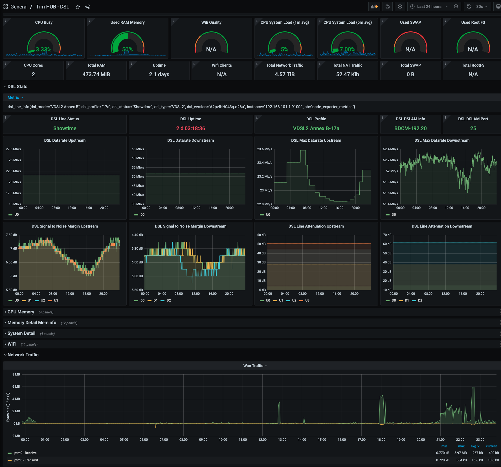

# prometheus-node-exporter-lua-technicolor

## Description

This is an extension of the OpenWrt utils/prometheus-node-exporter-lua/ package containing a lightweight rewrite in LUA of the offical Prometheus node_exporter, with additional support for retrieving metrics from technicolor DSL modems like the DGA4130 or DGA4132.


## Usage

This repository is intended to be used on supported DSL modems, it has been developed and tested on a TIM branded Technicolor DGA4132 dsl modem, rooted and patched with the Ansuel gui (https://github.com/Ansuel/tch-nginx-gui)

All files in the files/ folder need to be copied over to the modem, and after doing that the prometheus node exporter service can be enabled by issuing the commands:

```
/etc/init.d/prometheus-node-exporter-lua enable
/etc/init.d/prometheus-node-exporter-lua start
```

The service is configured to listen by default on the 'lan' interface, if you need to change it you need to edit the file

/etc/config/prometheus-node-exporter-lua

and set the line

```
option listen_interface 'lan'
```

appropriately

Once started, the service will listen for incoming connections from a prometheus instance and will provide metrics to be stored in its engine


#Grafana Dashboard

the folder grafana contains an example Grafana dashboard that will display some of the metrics pulled from the modem, the ones specific to the DSL line are in the DSL section



## License

See [LICENSE](LICENSE) file.
